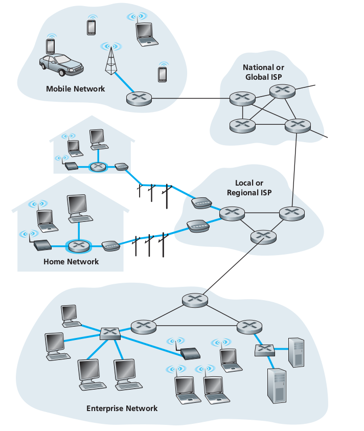

# Chapter 1: Internet Introduction

* **What is the Internet?**

* **Protocol**
    * Defines the format and order of messages exchange between
    two or more communicating entities, as well as actions
    taken on transmission and/or receipt of messages or
    other events
    
* **Network Edge**
    * All end systems that are connected to network.
    End systems include desktop computers, servers, mobile
    computers... 
    * End systems == hosts because they host (that is, run) 
    application programs such as Web browser program, Web server
    program, email client program...
    
* **Network Core**
    The network core contains **routers and link-layer switches**.
    * **Packet switching** -- To send messages from source host to destination host, the source breaks the long message into smaller chunks of data called *packet*. Each packet travels through the communication links and packet switches.
    * **Circuit switching** -- In circuit-switched network, the resources needed along a path to provide for communication between hosts are *reserved* for the duration of communication. In packet-switched network, the resources are *not reserved*.

* **Throughput** is the rate in bits/second at which destination is receiving packets.

* **Protocol Layer, Layered Architecture**
