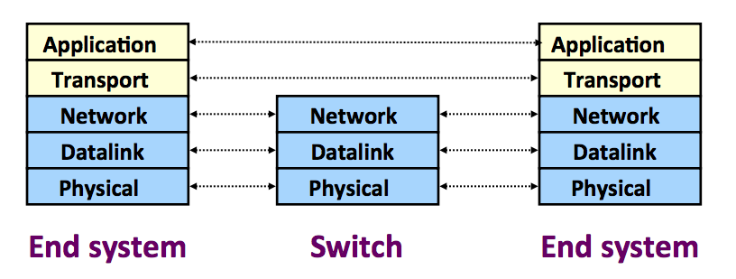

# Chapter 1: Internet Introduction

* **What is the Internet?**

  

* **Protocol**
    * Defines the format and order of messages exchange between
    two or more communicating entities, as well as actions
    taken on transmission and/or receipt of messages or
    other events
    
* **Network Edge**
    * All end systems that are connected to network.
    End systems include desktop computers, servers, mobile
    computers... 
    * End systems == hosts because they host (that is, run) 
    application programs such as Web browser program, Web server
    program, email client program...
    
* **Network Core** 
    The network core contains **routers** and **link-layer switches**.
    * **Packet switching** -- To send messages from source host to destination host, the source breaks the long message into smaller chunks of data called *packet*. Each packet travels through the communication links and packet switches.
    * **Circuit switching** -- In circuit-switched network, the resources needed along a path to provide for communication between hosts are *reserved* for the duration of communication. In packet-switched network, the resources are *not reserved*.

* **Throughput** is the rate in bits/second at which destination is receiving packets.

* **Protocol Layer, Layered Architecture** 
 
    * **Application Layer** is where network applications and their application-layer protocols reside. The Internet's application-layer includes many protocols such as HTTP for Web, SMTP for email, FTP for file transfer, etc. An application-layer protocal is distributed over multiple end systems with one application in one host using the protocol to exchange the messages with the application in another host.
    * **Transport Layer** transports the application-layer messages between application(process) endpoints. The Internet has two transport protocols: TCP and UDP. TCP provides connection-oriented service and reliable data transfer. The UPD does not provide both of these services. The TCP protocol also provides a congestion-control mechanism while UDP does not.
    * **Network Layer** provides the service of moving network-layer packets known as datagrams from one host to another over the network. It sounds similar to Transport Layer but it does not. Transport Layer tranfer data from process to proces  while Network Layer transfer data from host to host over the network. The Internet includes **IP protocol**. All Internet components that have a network layer must run IP protocol. The Internet's network layer also contains the routing protocols that determine the route that the datagrams travel between source and destination. The Internet has many routing protocols. The Internet is a network of networks, within a network the network administrator can run any desired routing protocols. The bottom line is the network layer contains both IP protocol and routing protocols. 
    * **Link Layer**
    * **Physical Layer**
