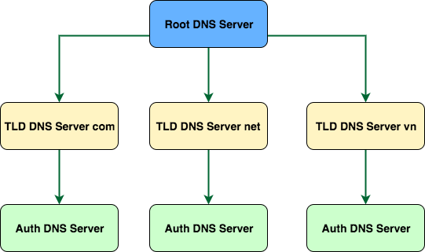

# Chapter 2: Application Layer

### 2.1 Principles of Network Applications
At the core of network application development is writing programs that run on different end systems and communicate with each other over the network.For example, Web application contains browser running on user's hosts and Web server running on the server. Browser and Web server communicate with each other over the Internet. 

Importantly, we don't need to write programs running on network core devices such as routers and link-layer switches.

* **Network Application Architecture** 
    Keep in mind that application architecture is distinctly different from the network architecture (layered architecture). There are 2 main architectures in network application: client-server and peer-to-peer.

    * The client-server architecture has one host called *server* that is always-on and services requests from many *clients*. Note that, in the client-server architecture, the clients don't communicate directly to each other, they do via the server. Another characteristic of client-server architecture is that the server is fixed, well-known address, called an IP address.
    * The peer-to-peer architecture has minimal (or no) reliance on dedicated server. Instead the application expoits the direct communication between pair of connected hosts, called *peers*. 

* **The Process Communicating**
    * A process can be thought of as a program running within an end system. When processes running on the same end system they can communicate with each other with interprocess communication. Processes on different end systems communicate with each other by exchange the messages across the computer network.
    * *In the context of communication session between a pair of processes, the process that initiates the communication is called client. The process that waits to be connected is called the server.*
    * A process sends messages into, and receives messages from, the network through a software interface called **socket**. A socket is the interface between the application layer and the transport layer within a host. Since the socket is the programming interface with which applications are built, the application developer has control of everything on application layer side of the socket and has little control of transport layer side of the socket. The only control the application developer has on transport layer side is (1) the transport protocol and (2) few transport parameter such as muximum buffer.
    * In the Internet, the host is idenitfied by its **IP address**. In addition to knowing the address of the destination host, the sending process must also identify the process running on the destination host. This information is needed because a host can run many network application processes. A destination **port number** serves this purpose. For example, Web server is identified by port 80.

* **Transport Services Available to Applications** 
    Recall that the socket is the programming interface between the application process and the transport layer protocol. The process at the sending side pushes to messages through a socket. At the other side of the socket, the transport layer protocol has responsibility of getting the messages to the socket of receiving process. What are the services that the transport layer protocol provides the application layer?
    * Reliable Data Transfer
    * Throughput
    * Timing
    * Security

* **Transport Services Provided by the Internet** 
    The Internet (or more generally, the TCP/IP networks) provides two transport protocols to the application layer, TCP and UDP. When the application developer creating an network application, one of the first decision he/she has to decide is which transport protocol he/she need to use.
    * TCP provides *connection-oriented service* and *reliable data transfer service*. Before the application-level messages are exchanged, the client and server have to exchage the transport layer information. This socalled hanshaking procedure. After the handshaking, a TCP connection is said to exist between the sockets of the two processes. The connection is a full-duplex connection meaning they can send and receives messages at the same time. When the applications finishes sending the messages, it must tear down the connection. The application layer can rely on TCP to deliver all data without error and in proper order.
    * UDP is connectionless, no handshaking before processes start to communicate. UDP provides unreliable data transfer.

### 2.2 DNS: The Internet's Directory Service
The host can be identified by *hostname* and *IP address*.
#### 2.2.1 Services Provided by DNS
We need a service that translates hostname to IP address. That's the main task of **DNS (Domain Name System)**. The DNS is (1) a distributed database implemented in a hierarchy of **DNS servers** and (2) a application layer protocol that allows hosts to query distributed database. The DNS servers are often the UNIX machines running Berkeley Internet Name Domain (BIND). The DNS protocol runs over UDP and uses port 53. DNS provides some other important services:
* **Host aliasing.** A host with a complicated hostname (which called *canonical hostname*) can have one or more alias names. Alias hostnames are typically more mnemonic than canonical hostnames. DNS can be invoked by an application to get the canonical of an alias hostname.
* **Load distribution**. DNS is also used to perform load distribution among replicated servers such as Web servers. Busy sites are replicated over multiple servers. Each server has its own IP address. For replicated servers, a *set* of IP addresses are associated with a canonical hostname. The DNS database contains this set of addresses. When clients make an DNS query for a name mapped to a set of addresses, the name server responds with entire set of addresses, but rotates the order of the set of addresses within each reply. DNS rotation helps to distribute the traffic among replicated servers.

#### 2.2.2 How DNS works
Suppose an applicaton running on user's host need to translaste a hostname to address. The application will invoke the client side of DNS, specifying the hostname need to be translated. The DNS in the user's will take over, sending name query into network. All DNS query and reply messages are sent with UDP datagrams to port 53. After a delay, the DNS in the user's host receives the disired mapping. This mapping is then passed to invoking application.
* **A Distributed, Hierachical Database** 
 
The DNS uses large number of name server, organized in a hierachical fashion and distributed around the world. No single name server has all the mappings for all the hosts on the Internet. There are three classes of DNS servers: (1) *root name server*, (2) *top-level domain name server* and (3) *authoritative name server*.

    * **Root name servers** manages Top-level domain name servers.
    * **Top-level domain name servers** are responsible for top-level domains such as com, org, net, edu, gov and all the country top-level domains such as vn, jp, fr, etc. 
    * **Authoritative name servers**. Every organization, that has publicly accessible hosts such as Web servers and mail servers, must provides publicly accessible DNS records that map the names of these hosts to IP addresses. An organization's authoritative name servers house these DNS records.

    To understand how these 3 classes of name servers works, suppose a DNS client wants to know the IP address of the host name xxx.com. The client first contact with the root name server, the root name server will respond the IP of top-level domain name server for .com. The client contact with .com top-level domain server to get the address of authoritative name server that contains the DNS record for xxx.com. Finally the client will contact the authoritative name server to get IP address of hostname xxx.com.

* **DNS Caching** 
DNS Caching is critically important to improve DNS delay performance and reduce the number of DNS messages travel on the Internet. The idea behind the DNS Caching is very simple. Each time a DNS server receives a DNS reply, it can cache the mapping in its local memory. If a mapping is cached in a name server, and another query for the same hostname arrives, the server can reply the IP address even it's not the authoritative name server.

#### 2.2.3 DNS Records and Messages
DNS servers store **resource records (RRs)** which have the format **(Name, Value, Type, TTL)**. TTL is time to live of the record; it determines when the record should be removed from cache. We will ignore it here. The meaning of Name and Value depend on the Type:
* **Type A**, Name is the hostname and Value is the IP address. (relay1.bar.foo.com, 145.37.93.126, A) is an example.
* **Type NS**, Name is the domain and Value is the hostname of authoritative DNS server that knows the IP address of the domain. This type of record is used to continue to send DND query. (foo.com, dns.foo.com, NS) is an example.
* **Type CNAME** Name is the alias name and Value is the canonical name. (foo.com, relay1.bar.foo.com, CNAME) is an example.
* **Type MX** Name is the alias of mail server and Value is the canonical name of that mail server. (foo.com, mail.bar.foo.com, MX) is an example.

### 2.3 Socket Programming
* **[TCP](code/socket/src/main/java/com/tamco/web/SimpleWebServer.java)**
* **[UDP](code/datagram-socket/src/com/tamco/udp)**
