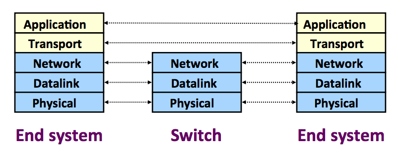
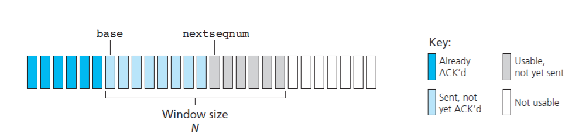
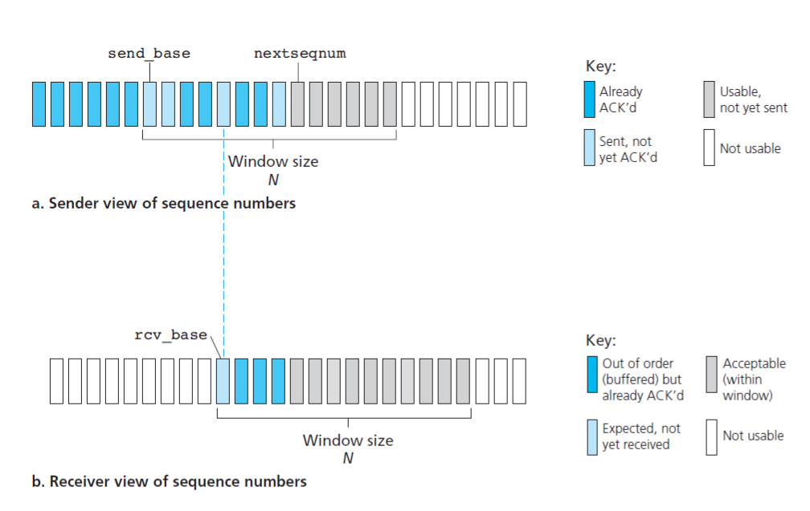
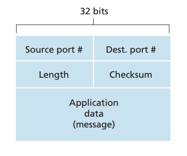

# Chapter 3: Transport Layer

### 3.1 Transport Layer and Network Layer
* Network layer provides **logical communication** between *hosts (end systems)*
* Transport layer provides **logical communication** between *processes* running on different hosts
* Transport layer is implemented only in end systems

  

* Transport layer uses the service provided by the Network layer to provide its service
* Example
    * There 2 houses, one in East Coast and one in West Coast. In each house, there are 12 children living in. They are cousins. They love to write to each other in other house every week.
    * Ann lives in the house in East Coast and Bill lives in the house in West Coast. They are responsible for mail collection and distribution. Every weekend, Ann and Bill will collect mails from cousins in the house to put to mailbox and get the arrived mails from mailbox to distribute to their cousins.
    * Every weekend, the postmans will come with arrived mails to put to mailbox and also get the waiting mails from mailbox to send to destination house.
    * In this example, houses are the hosts (end systems); children are the processes running on hosts; postmans are the network layer, they provide a logical communication between houses; Ann and Bill are transport layer, they provides a logical communication between children (processes).
    * We can see that in this example, Ann and Bill only all their work within the house they living, they are not involved in moving mails from one mail center to another. This is similar to transport layer, only implemented in end systems.
    * Ann and Bill use the service provided by the postmans to do their job.

### 3.2 Services Provided by Transport Layer
* **Multiplex and Demultiplex**
    * **Demultiplex** is the job of delivering incoming transport layer segments to the correct socket in receiving host based on the port; demultiplex happens at destination host.
    * **Multiplex** is the job of gathering data chunks at source host from different socket, encapsulating each data chunk with header information (that will be used later by demultiplex) and creating segments to pass to network layer; multiplex happens at source host.
* **Reliable Data Transfer**
    * Transport layer may or may not provide *reliable data transfer* service. For example, in the Internet, TCP provides *reliable data transfer* servive but UDP does not. *Reliable data transfer* means data will be transfered in order and integrity.
    
    
* **Error Detection**
* **Congestion Control**

### 3.3 Reliable Data Transfer Protocol
#### 3.3.1 Stop and Wait
* Send a segment --> Wait for acknowledgement --> Send a segment --> Wait for acknowledgement...
#### 3.3.2 Pipeline
* **Go Back N**
    * The sender is allowed to send multiple packets without waiting for an acknowledgement but is constrained to have no more than the maximum number, N, of the unacknowledged packets in the pipeline.

    * Events that the sender in Go-Back-N protocol must handle
        * *Invocation from above (applicaiton layer)*. When ***rdt_send()*** is called from above the sender first check if the window (N) is full. If the window is not full a packet will be created and sent and all related variable are updated.
        * *Receipt of an acknowledgement*. In GBN protocol, an ACK for packet n will be taken to be ***cumulative acknowledgement***, meaning that all packets with sequence number up to and including n have been correctly revceived at receiver.
        * *A timeout occurs*. If a timeout occurs the sender will resend all previous packets that sent but not acknowledged. This is why the protocol is called Go-Back-N. The sender uses only one single timer. 
        
    * Events that the receiver in Go-Back-N protocol must handle
        * *Packet with sequence number n is received correctly and in order*. Receiver will send an ACK for packet n and deliver data portion to upper layer (application).
        * *All other cases*. Receivers discards the packet and resend an ACK for the most recently received in-order packet.

  

* **Selective Repeat**
    * Events that the sender in Selective Repeat must handle
        * *Invocation from above (application layer)*. Similar to Go-Back-N protocol.
        * *Receipt of an ACK*. The packet will be marked as received. The sender will check if there is continuous array of packets that has been received then the window will move forward. All packets that fall into window will be sent. If not the window stays the same.
        * *A timeout occurs*. 
    * Events that the receiver in Selective Repeat must handle
        * **
        

  

### 3.4 UDP
* Why choosing UDP to develop a network application when it does not provide *reliable data transfer* service? The anwser is as many applications are better suited for UDP for the following reasons:
    * *Finer application-level control over what data is sent and when.* Under UDP, as soon as an application process passes data to UDP, UDP will package the data inside an UDP segment and immediately pass the segment to network layer. TCP, on the other hand, has a congestion control mechanism that control when data is sent.
    * *No connection establishment.* TCP uses a three-way handshake before it starts sending data. UDP just blasts away without any formal preliminaries. Thus DNS does not introduce any delay to establish a connection.
    * *No connection state.* TCP maintains connection state in the end systems. This connection state includes **receive and send buffer, congestion-control parameters, sequence number and acknowledgement number**. UDP, in the other hand, does not maintain connection state.
    * *Small packet header overhead*. TCP header has 20 bytes while UDP header has 8 bytes.

* **UDP Segment**

  

* **UDP Checksum**
    * Checksum is used for error detection.
    * The data of packet will be divided into bunch of 16 bit words. We calculate the sum of all the words (overflow is ignored) then perform 1's complement on that sum. 1's complement is performed by revert bit 0 to 1 and bit 1 to 0. We place the result to the checksum field.
    * At the receiver, we also divided data of packet into bunch of 16 bit words. We sum all the words and the checksum (overflow is ignored). If the result is **1111 1111 1111 1111** the the data is correct.

### 3.5 TCP
#### 3.5.1 Three Way Handshake
#### 3.5.2 TCP Segment Structure
#### 3.5.3 Sequence Number and Acknowledgement Number 
#### 3.5.4 Reliable Data Transfer of TCP
#### 3.5.5 TCP Connection Management
#### 3.5.5 Flow Control
#### 3.5.6 Congestion Control

 
